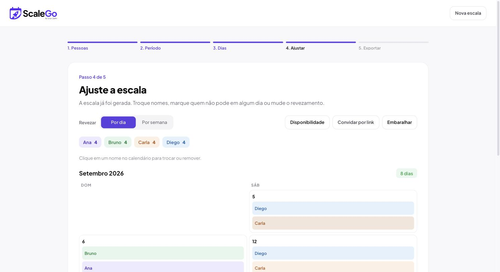
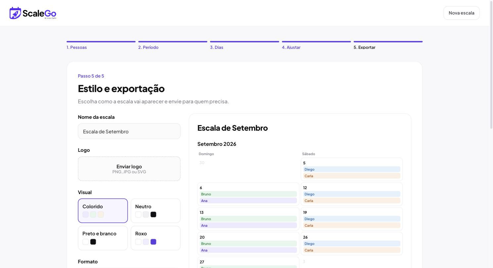

### Monte a escala do seu time em 5 passos — sem conta, sem servidor.

**[Abrir o ScaleGo →](https://juniorcarlini.github.io/scalego/)**

 

  
  

 

## O que é

Escala de plantão, de limpeza, de horário, de time de trabalho — qualquer
revezamento em que várias pessoas precisam se dividir em cima de um período.
O ScaleGo monta isso sozinho: você cadastra quem participa, escolhe o período
e os dias, e a escala sai pronta e justa, sem ninguém ficar sobrecarregado.
Ajusta o que quiser na mão e manda pronto pra quem precisa.

Sem conta, sem login, sem instalar nada. Roda inteiro no seu navegador —
os dados da escala ficam salvos só ali, no seu computador.

## Como funciona

Um assistente de 5 passos: **Pessoas → Período → Dias → Ajustar → Estilo e
exportação**. A escala é recalculada em tempo real a cada mudança — não tem
botão "gerar", o resultado já aparece assim que você mexe em qualquer regra.

### Rodízio justo

Pra decidir quem entra em cada dia, a prioridade é sempre: primeiro quem tem
**menos dias** acumulados até ali, depois quem foi escalado **há mais tempo**,
e só em último caso uma ordem aleatória fixa — o suficiente pra ninguém ficar
preso numa sequência ruim, sem parecer aleatório demais.

Não gostou de uma troca específica? Clica no nome do dia e escolhe outra
pessoa na hora — essa troca fica marcada e é preservada mesmo que a escala
se reorganize, até que você mude alguma regra de geração (aí ela é refeita do
zero, pra nunca ficar inconsistente).

### Convidar por link

Em vez de ficar perguntando um por um quem pode ou não em cada dia, dá pra
gerar um link e mandar pra pessoa. Ela abre, escolhe o próprio nome, marca no
calendário de verdade as datas específicas que **não** pode — "não posso dia
12" é bem diferente de "não posso todo sábado" — e gera um link de resposta
de volta. Você abre esse link e importa com um clique.

Tudo isso viaja codificado no próprio link, sem passar por nenhum servidor.

### Exportar

- **WhatsApp** e **Copiar** — texto já formatado, pronto pra colar.
- **PDF** — pra imprimir ou guardar, com o layout adaptado pra página.
- **Planilha** — um `.csv` que abre certinho no Excel, acentos incluídos.

## Privacidade

Não existe backend. Nada do que você digita sai do seu navegador: as pessoas,
os dias, os ajustes — tudo fica no `localStorage`. O link de convite carrega o
estado necessário codificado nele mesmo, e o link de resposta faz o caminho de
volta do mesmo jeito. Ninguém além de quem está com o link vê a escala.

---

Feito por <a href="https://github.com/JuniorCarlini">Junior Carlini</a>

